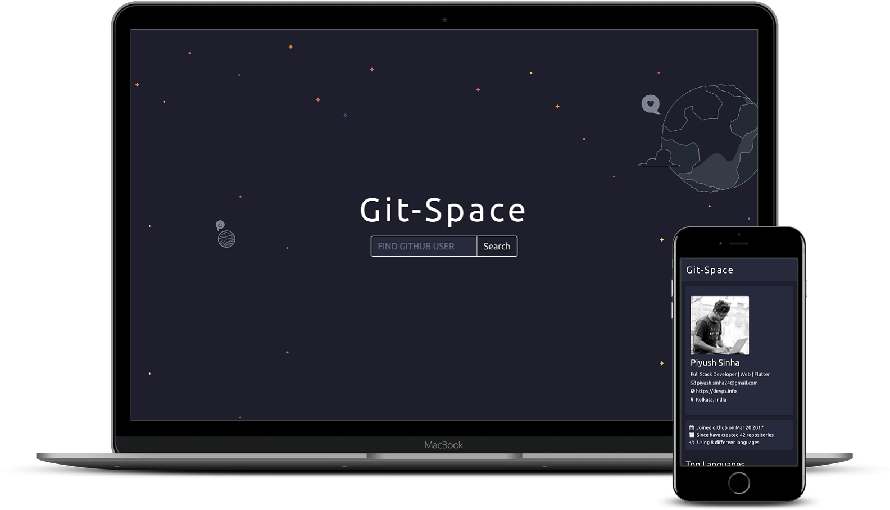

[](https://app.netlify.com/sites/git-space/deploys)

# Git-Space


# :man_technologist: Technology Stack
* [React](https://reactjs.org)
* [React Bootsrap](https://react-bootstrap.github.io)
* [React Minimal Pie Chart](https://www.npmjs.com/package/react-minimal-pie-chart)
* [Font Awesome Icons](https://fontawesome.com)
### API
* [Github API](https://developer.github.com/v3/)
# :zap: Installation
1. Clone / Download this repo.
2. Inside the project open a terminal and run:
```bash
npm install
```
This will install all the project dependencies.
3. Create a .env file in the project root folder and add the following:
```bash
REACT_APP_GITHUB_CLIENT_ID = yourClientId
REACT_APP_GITHUB_SECRET_ID = yourSecretKey
```
Get your Client Id and Secret Id by signing in to your github account and then go to your setting -> developer setting -> OAuth Apps -> New OAuth App

4. To start the development server run:
```bash
npm start
```
